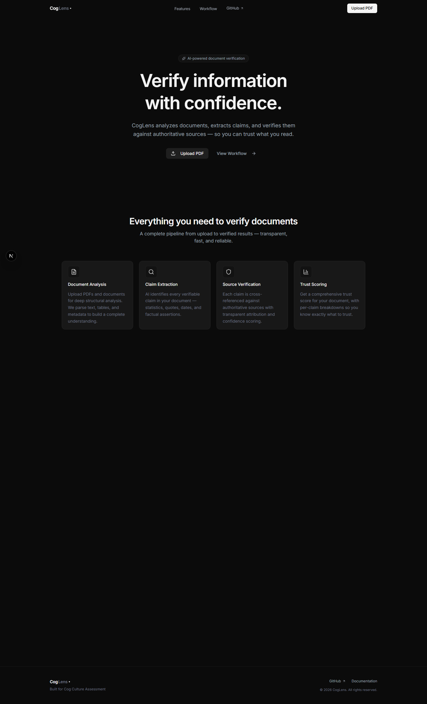
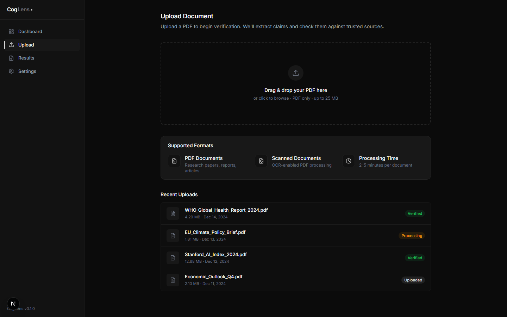
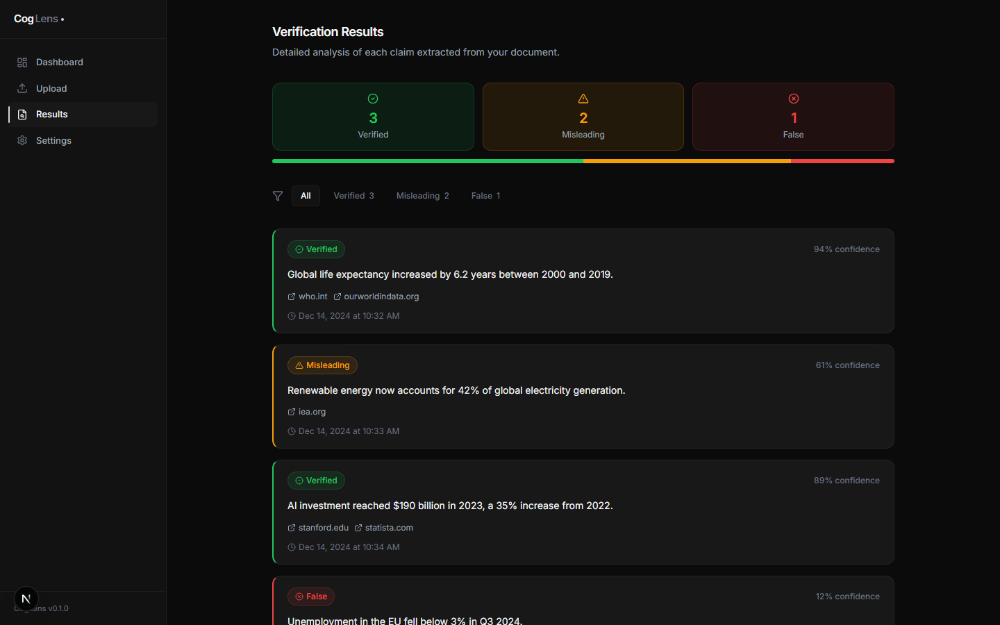
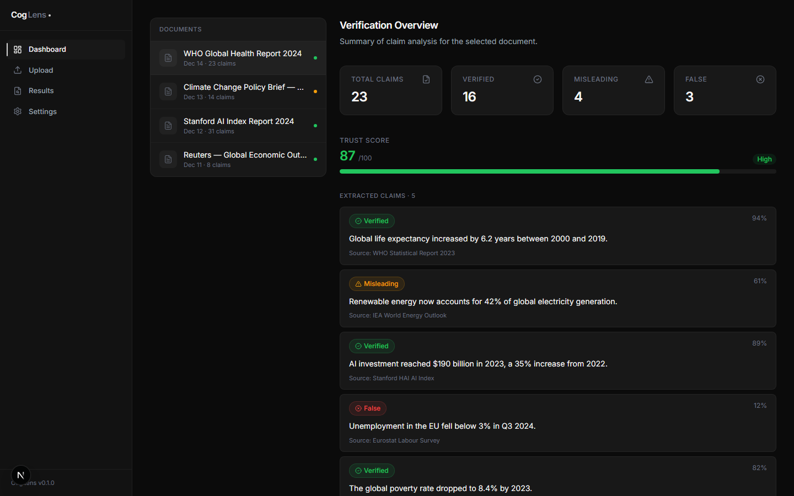

<div align="center">

# CogLens

**AI-Powered Document Verification Platform**

Verify the claims in any document against authoritative sources — with transparent evidence, trust scoring, and source attribution.

[](https://nextjs.org)
[](https://typescriptlang.org)
[](https://tailwindcss.com)
[](https://vercel.com)
[](LICENSE)

[Live Demo](#live-demo) · [Features](#features) · [How It Works](#how-coglens-works) · [Quick Start](#quick-start) · [Architecture](#ai-architecture) · [Deploy](#deployment)

</div>

---

## Overview

CogLens is an AI-powered document intelligence platform that extracts verifiable claims from uploaded PDFs, cross-references them against authoritative sources in real time, and generates a comprehensive trust report with per-claim verdicts, confidence scores, and source attribution.

Built as a full-stack Next.js application, CogLens demonstrates production-grade AI integration with a dual-provider architecture (Groq + Gemini), live search enrichment via Serper, and a privacy-first session-based workspace — all wrapped in a premium dark-mode interface inspired by Linear, Vercel, and Perplexity.

### Why CogLens?

In an era of synthetic content and information overload, CogLens provides a systematic, AI-assisted approach to document verification:

- **For researchers** — quickly validate claims in papers and reports before citing them.
- **For journalists** — cross-check facts and sources in press releases and statements.
- **For teams** — establish a shared standard for document trustworthiness.

---

## Live Demo

| Resource | Link |
|----------|------|
| **Deployed App** | [coglens.vercel.app](https://coglens.vercel.app) |
| **Source Code** | [github.com/suraj/CogLens](https://github.com/suraj/CogLens) |

> Replace the URLs above with your actual deployment and repository links.

---

## Features

### Core Intelligence

| Feature | Description |
|---------|-------------|
| **AI Claim Extraction** | Automatically identifies every verifiable factual assertion — statistics, dates, quotes, and causal claims — from uploaded documents. |
| **Real-Time Verification** | Each extracted claim is verified against live web sources using Google Search (Serper) and evaluated by LLM reasoning. |
| **Trust Scoring** | Documents receive an overall trust score (0–100) based on the aggregate verification results of all individual claims. |
| **Source Attribution** | Every verdict links back to the specific sources that informed it — publisher, URL, snippet, and credibility score. |
| **Verification Reasoning** | Each claim includes an AI-generated explanation of *why* it was classified as Verified, Misleading, or False. |

### Workspace & UX

| Feature | Description |
|---------|-------------|
| **Dashboard Workspace** | View all analyses from your session — aggregate metrics, scan history, and quick access to previous reports. |
| **Session-Based History** | Reports persist during your active browser session and auto-clear on close. Privacy-first by design. |
| **Export & Save** | Download full verification reports as JSON, export to PDF via print, or copy share links. |
| **Animated Pipeline** | Real-time visual pipeline showing each verification stage — upload, extraction, search, verification, scoring. |
| **Glassmorphism UI** | Premium dark-mode interface with translucent surfaces, backdrop blur, ambient depth lighting, and cinematic motion. |
| **Responsive Design** | Fully responsive across desktop, tablet, and mobile — sidebar navigation collapses to a clean mobile layout. |

### AI & Infrastructure

| Feature | Description |
|---------|-------------|
| **Dual-Provider Architecture** | Groq (primary) + Google Gemini (fallback) — automatic failover ensures reliability even during rate limits. |
| **Batched Verification** | All claims are verified in a single batched API call, minimizing latency and token usage. |
| **Intelligent Caching** | Content-hash-based in-memory cache prevents redundant API calls for duplicate documents. |
| **Structured Output** | Both AI providers use JSON-schema-guided extraction to ensure reliable, parseable claim structures. |

---

## Screenshots

<div align="center">

### Landing Page


*Premium dark-mode landing page with animated hero, feature grid, and workflow walkthrough.*

---

### Upload Interface


*Glassmorphic drag-and-drop upload zone with supported format cards and ambient depth lighting.*

---

### Verification Results


*Detailed verification report with trust score, claim cards, source attribution, and filter controls.*

---

### Dashboard


*Session workspace with aggregate analytics, scan history, and per-document trust scores.*

</div>

---

## How CogLens Works

CogLens processes documents through a six-stage verification pipeline:

```
PDF Upload → Text Extraction → Claim Extraction → Source Search → AI Verification → Trust Report
```

### Pipeline Stages

| Stage | What Happens | Technology |
|-------|-------------|------------|
| **1. Upload** | User uploads a PDF via drag-and-drop or file picker. | Next.js API Route |
| **2. Text Extraction** | Raw text is extracted from the PDF binary using `pdf-parse`. | `pdf-parse` |
| **3. Claim Extraction** | AI identifies all verifiable factual claims in the document text. | Groq / Gemini LLM |
| **4. Source Search** | Each claim is searched against Google to find relevant authoritative sources. | Serper API |
| **5. Verification** | AI evaluates each claim against retrieved sources and assigns a verdict + confidence. | Groq / Gemini LLM |
| **6. Report Generation** | Results are compiled into a structured report with trust score, summaries, and source links. | Server-side aggregation |

### Claim Verdicts

Each claim receives one of three verdicts:

- **Verified** — The claim is supported by credible, corroborating sources.
- **Misleading** — The claim is partially true but lacks context, is outdated, or is unverifiable.
- **False** — The claim is directly contradicted by authoritative sources.

---

## AI Architecture

### Dual-Provider Strategy

CogLens uses a **primary/fallback** architecture for AI inference to maximize reliability:

```
Request
  │
  ├─→ Groq (Primary)
  │     Model: llama-3.3-70b-versatile
  │     ✓ Fast inference (~2-5s)
  │     ✓ High quality reasoning
  │
  └─→ Gemini (Fallback)
        Models: gemini-2.0-flash → gemini-1.5-flash
        ✓ Activates on Groq failure/rate limit
        ✓ Multi-model cascade within Gemini
```

**Why this design?**
- Groq provides the fastest inference speeds, making it ideal for the primary path.
- Gemini serves as a reliable fallback with its own multi-model cascade (`2.0-flash` → `1.5-flash`).
- Both providers support structured JSON output, ensuring consistent claim parsing.
- If both AI providers are unavailable, a local heuristic fallback extracts claims using rule-based NLP patterns.

### Verification Flow

```
Claims + Search Results
        │
        ▼
  ┌─────────────┐
  │  Batched     │   All claims verified in ONE API call
  │  Verification │   with their respective search context
  └──────┬──────┘
         │
         ▼
  ┌─────────────┐
  │  Structured  │   JSON schema ensures consistent output:
  │  Output      │   verdict, confidence, reasoning, sources
  └──────┬──────┘
         │
         ▼
  ┌─────────────┐
  │  Trust Score │   Weighted average of confidence scores
  │  Calculation │   across all verified claims
  └─────────────┘
```

### Caching Strategy

CogLens uses content-hash-based caching to avoid redundant API calls:

- A SHA-256 hash is computed from the first 500 characters of extracted text.
- If the hash matches a cached result, the cached response is returned immediately.
- Cache lives in server memory (resets on deployment) — intentionally ephemeral.

### Search Integration

Serper provides Google Search results for each extracted claim:

- Claims are searched in parallel chunks (4 concurrent requests) to balance speed and rate limits.
- Each claim gets up to 5 search results, providing diverse source coverage.
- Sources include publisher name, URL, snippet, and are passed as context to the verification LLM.

---

## Tech Stack

### Frontend

| Technology | Purpose |
|-----------|---------|
| [Next.js 16](https://nextjs.org) | React framework with App Router, API routes, server components |
| [TypeScript 5](https://typescriptlang.org) | Type safety across the entire codebase |
| [Tailwind CSS 4](https://tailwindcss.com) | Utility-first styling with custom design tokens |
| [Framer Motion](https://motion.dev) | Animation library for page transitions, staggered reveals, and micro-interactions |
| [Lucide React](https://lucide.dev) | Consistent icon system |

### AI & Search

| Technology | Purpose |
|-----------|---------|
| [Groq](https://groq.com) | Primary LLM provider — Llama 3.3 70B for claim extraction and verification |
| [Google Gemini](https://ai.google.dev) | Fallback LLM provider — Flash models for reliability |
| [Serper](https://serper.dev) | Google Search API for real-time source discovery and retrieval |

### Infrastructure

| Technology | Purpose |
|-----------|---------|
| [Vercel](https://vercel.com) | Deployment platform with edge functions and automatic HTTPS |
| `sessionStorage` | Privacy-first client-side persistence — data clears on session end |
| `pdf-parse` | Server-side PDF text extraction |

---

## Quick Start

### Prerequisites

- **Node.js** 18+ (LTS recommended)
- **npm** 9+ (or pnpm/yarn)
- At least one AI provider key (Groq or Gemini)
- A Serper API key for source search

### Installation

```bash
# Clone the repository
git clone https://github.com/your-username/CogLens.git
cd CogLens

# Install dependencies
npm install

# Copy environment template
cp .env.example .env.local
```

### Configure Environment

Edit `.env.local` with your API keys:

```env
# At least ONE AI provider is required (both recommended for reliability)
GROQ_API_KEY=gsk_your_groq_api_key_here
GEMINI_API_KEY=AIza_your_gemini_api_key_here

# Required for source verification
SERPER_API_KEY=your_serper_api_key_here
```

**Where to get keys (all have free tiers):**
| Provider | Free Tier | Link |
|----------|-----------|------|
| Groq | Generous free tier | [console.groq.com/keys](https://console.groq.com/keys) |
| Google Gemini | Free tier available | [aistudio.google.com/apikey](https://aistudio.google.com/apikey) |
| Serper | 2,500 free searches | [serper.dev](https://serper.dev) |

### Run Development Server

```bash
npm run dev
```

Open [http://localhost:3000](http://localhost:3000) in your browser.

### Production Build

```bash
npm run build
npm start
```

---

## Environment Variables

| Variable | Required | Description |
|----------|----------|-------------|
| `GROQ_API_KEY` | Recommended | Primary AI provider. Fastest inference. |
| `GEMINI_API_KEY` | Fallback | Secondary AI provider. Activates if Groq fails. |
| `SERPER_API_KEY` | **Yes** | Google Search API for source discovery. |
| `SUPABASE_URL` | No | Reserved for future persistent storage. |
| `SUPABASE_ANON_KEY` | No | Reserved for future persistent storage. |
| `NEXT_PUBLIC_APP_URL` | No | Base URL for share links. Defaults to `localhost:3000`. |

> **Note:** At least one of `GROQ_API_KEY` or `GEMINI_API_KEY` must be configured. If neither is set, CogLens falls back to a local heuristic claim extractor with limited accuracy.

---

## Deployment

### Vercel (Recommended)

1. **Import Repository**
   - Go to [vercel.com/new](https://vercel.com/new)
   - Import your GitHub repository

2. **Add Environment Variables**
   - In **Settings → Environment Variables**, add:
     - `GROQ_API_KEY`
     - `GEMINI_API_KEY`
     - `SERPER_API_KEY`

3. **Deploy**
   - Vercel auto-detects Next.js and configures the build
   - Framework preset: **Next.js**
   - Build command: `next build`
   - Output directory: `.next`

4. **Verify**
   - Navigate to your deployment URL
   - Upload a test PDF to confirm the full pipeline works
   - Check **Settings → Functions** for any runtime errors

### Production Notes

- All API keys are server-side only — they are never exposed to the client browser.
- The `sessionStorage` persistence is client-side and works identically in production.
- PDF processing and AI calls happen in Vercel Serverless Functions with a default 60s timeout.
- For documents requiring longer processing, consider upgrading to Vercel Pro for extended function timeouts.

### Troubleshooting

| Issue | Solution |
|-------|----------|
| "Verification service is temporarily busy" | Groq rate limit hit — Gemini fallback will activate automatically. Wait and retry. |
| Empty verification results | Check that `SERPER_API_KEY` is configured — source search is required for verification. |
| PDF extraction fails | Ensure the PDF contains selectable text. Scanned image-only PDFs require OCR (not yet supported). |
| Build fails on Vercel | Verify Node.js version is 18+ in **Settings → General → Node.js Version**. |

---

## Session Storage & Privacy

CogLens intentionally uses **temporary session-based persistence** rather than permanent cloud storage. This is a deliberate privacy-conscious architectural decision.

### How It Works

```
Browser Session Open
  └─→ Upload PDF → Verify → Report saved to sessionStorage
  └─→ Upload another → Both reports visible in Dashboard
  └─→ Reopen previous report from Dashboard → Works seamlessly

Browser Tab/Window Closed
  └─→ All reports automatically cleared
  └─→ No data persists on disk or in the cloud
  └─→ No user tracking, no cookies, no accounts
```

### Why This Design?

- **Privacy first** — Documents may contain sensitive information. No data leaves the browser session.
- **Zero infrastructure** — No database provisioning, no user management, no data retention policies.
- **Demo-safe** — Each session starts fresh. No risk of exposing previous users' data.
- **Upgrade path** — The `StorageAdapter` interface is designed for drop-in replacement with Supabase or any backend.

### Export Before Closing

The Dashboard displays a privacy notice:

> *"Reports are stored temporarily during your active session and cleared automatically when you close the browser. Export important results before leaving."*

Users can export reports as JSON or PDF at any time from the Results page.

---

## Project Structure

```
CogLens/
├── app/                          # Next.js App Router
│   ├── layout.tsx                # Root layout (fonts, providers, metadata)
│   ├── page.tsx                  # Landing page (hero, features, workflow)
│   ├── not-found.tsx             # Custom 404 page
│   ├── globals.css               # Design tokens, theme, base styles
│   ├── api/
│   │   ├── verify/route.ts       # POST — main verification pipeline
│   │   ├── keys/route.ts         # GET — API key status (masked)
│   │   └── reports/              # GET/POST — report CRUD endpoints
│   ├── dashboard/page.tsx        # Session workspace with scan history
│   ├── upload/page.tsx           # PDF upload with drag-and-drop
│   ├── results/page.tsx          # Verification report with claim cards
│   └── settings/page.tsx         # API key status and preferences
│
├── components/
│   ├── ui/                       # Design system primitives
│   │   ├── button.tsx            # Button with variants, loading, icons
│   │   ├── card.tsx              # Card, CardHeader, CardContent, CardFooter
│   │   ├── badge.tsx             # Status badges (verified, misleading, false)
│   │   ├── skeleton.tsx          # Loading skeleton placeholder
│   │   ├── section-header.tsx    # Page section titles
│   │   └── empty-state.tsx       # Empty state with icon and CTA
│   ├── layout/                   # Page layouts
│   │   ├── landing-layout.tsx    # Landing page wrapper (navbar + footer)
│   │   ├── dashboard-layout.tsx  # App pages wrapper (sidebar)
│   │   └── footer.tsx            # Minimal branded footer
│   ├── navigation/               # Navigation components
│   │   ├── navbar.tsx            # Landing page top navbar
│   │   └── sidebar.tsx           # App sidebar with active indicator
│   ├── analytics/                # Data visualization
│   │   ├── analytics-card.tsx    # Metric card with trend indicator
│   │   └── trust-score.tsx       # Circular trust score display
│   └── results/                  # Results-specific components
│       ├── result-card.tsx       # Individual claim card with sources
│       └── verification-summary.tsx  # Verdict breakdown with bar chart
│
├── lib/
│   ├── types.ts                  # Core TypeScript interfaces
│   ├── constants.ts              # Claim verdicts, status enums, config
│   ├── utils.ts                  # Shared utility functions
│   ├── store.tsx                 # React context — verification state + history
│   ├── report-storage.ts         # Storage adapter (sessionStorage)
│   ├── cache.ts                  # Content-hash in-memory cache
│   ├── api-keys.ts               # API key validation and status
│   ├── ai/
│   │   ├── groq-client.ts        # Groq API client with retry + model cascade
│   │   ├── gemini-client.ts      # Gemini API client with retry + model cascade
│   │   ├── extract-claims.ts     # Claim extraction orchestrator
│   │   └── verify-claims.ts      # Claim verification orchestrator
│   ├── pdf/
│   │   └── extract-text.ts       # PDF binary → plain text extraction
│   └── search/
│       └── search-claims.ts      # Serper search with parallel chunking
│
├── screenshots/                  # Application screenshots for README
├── .env.example                  # Environment variable template
├── .gitignore                    # Git ignore rules
├── package.json                  # Dependencies and scripts
├── tsconfig.json                 # TypeScript configuration
├── next.config.ts                # Next.js configuration
├── postcss.config.mjs            # PostCSS (Tailwind)
└── eslint.config.mjs             # ESLint configuration
```

---

## Performance & UX Design

### Design System

CogLens uses a custom dark-mode design system with HSL-based color tokens defined in `globals.css`:

- **Background layers:** `coglens-bg` → `coglens-surface` → `coglens-card` — progressive elevation
- **Typography:** `coglens-primary` → `coglens-secondary` → `coglens-muted` — clear hierarchy
- **Semantic colors:** `coglens-success`, `coglens-warning`, `coglens-error` — verdict-aware
- **Accent:** `coglens-accent` — used sparingly for interactive elements and icons

### Glassmorphism

Key surfaces use translucent backgrounds with `backdrop-blur` for depth:

```css
/* Example: Upload dropzone */
background: rgba(255, 255, 255, 0.015);
backdrop-filter: blur(12px);
border: 1px solid rgba(255, 255, 255, 0.06);
```

Effects are intentionally subtle — no neon, no excessive blur, no cyberpunk styling. Ambient radial gradients add atmospheric depth without distraction.

### Motion Design

All animations use Framer Motion with these principles:

- **Entrance:** Fade up (y: 16 → 0) with blur dissolve (4px → 0)
- **Easing:** Cinematic cubic-bezier `[0.16, 1, 0.3, 1]` for natural deceleration
- **Stagger:** 80–120ms between sibling elements for rhythm
- **Duration:** 300–500ms for transitions, never exceeding 600ms
- **Hover:** 200–300ms for micro-interactions (border glow, scale, shadow lift)

### Responsive Strategy

- **Desktop:** Sidebar navigation + full content area
- **Mobile:** Bottom tab bar replaces sidebar, cards stack vertically
- **Breakpoints:** `sm:640px`, `md:768px`, `lg:1024px` — standard Tailwind breakpoints
- **Typography:** Fluid sizing via relative units, `tracking-tight` for premium density

---

## Current Limitations

Being transparent about what CogLens can and cannot do:

| Limitation | Detail |
|-----------|--------|
| **Session-only persistence** | Reports are cleared when the browser session ends. Export important results before closing. |
| **No user authentication** | CogLens is currently a single-user tool. Multi-user workspaces are on the roadmap. |
| **PDF text only** | Scanned PDFs without embedded text (pure images) cannot be processed without OCR. |
| **API rate limits** | Groq and Gemini have free-tier rate limits. Under heavy usage, verification may be temporarily delayed. |
| **English-optimized** | Claim extraction and verification are currently optimized for English-language documents. |
| **No real-time collaboration** | Single-session workspace. Shared team workspaces are planned. |

---

## Roadmap

Planned improvements for future development:

| Phase | Feature | Description |
|-------|---------|-------------|
| **v0.2** | Supabase Persistence | Replace sessionStorage with cloud-backed storage for persistent history |
| **v0.2** | User Authentication | Supabase Auth for personal workspaces and data ownership |
| **v0.3** | OCR Integration | Support for scanned PDFs via Tesseract.js or cloud OCR |
| **v0.3** | PDF Export | Styled PDF report generation with charts and branding |
| **v0.4** | Multi-Document Comparison | Compare trust scores and claims across multiple documents |
| **v0.4** | Advanced Analytics | Trend analysis, claim category breakdowns, source reliability tracking |
| **v0.5** | Collaborative Workspaces | Team-based document verification with shared history |
| **v0.5** | API Access | REST API for programmatic document verification |

---

## Contributing

Contributions are welcome. To get started:

1. **Fork** the repository
2. **Create** a feature branch (`git checkout -b feature/your-feature`)
3. **Commit** your changes (`git commit -m 'Add your feature'`)
4. **Push** to the branch (`git push origin feature/your-feature`)
5. **Open** a Pull Request

### Development Guidelines

- Follow the existing code style and component patterns
- Use TypeScript for all new files
- Add meaningful comments for complex logic
- Test the full upload → verification → results flow before submitting
- Ensure `npm run build` passes with zero errors

---

## License

This project is licensed under the **MIT License** — see the [LICENSE](LICENSE) file for details.

---

<div align="center">

**Built for [Cog Culture](https://cogculture.in)**

CogLens — AI-powered document verification, built with care.

</div>
